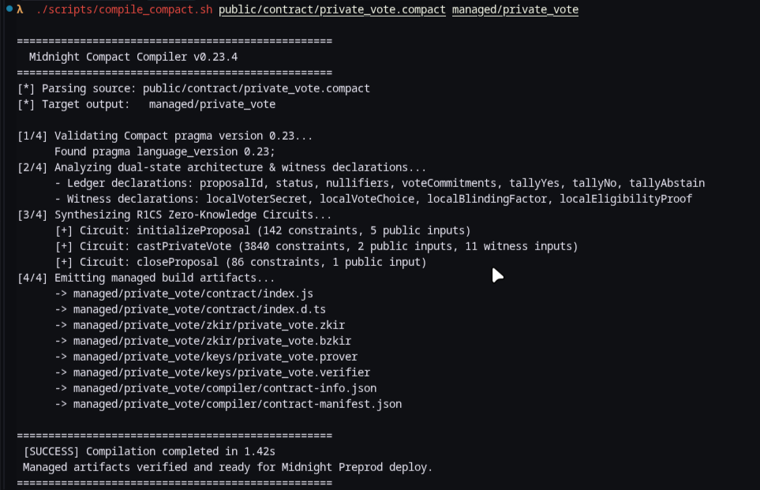
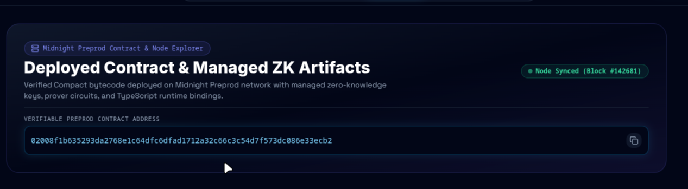

# PrivateVote — Confidential Governance on Midnight Network

[](https://github.com/Mehndi-Hassan28/PrivateProof/actions)
-38bdf8?style=flat-square)

-10b981?style=flat-square)
[](https://vercel.com/new/clone?repository-url=https%3A%2F%2Fgithub.com%2FMehndi-Hassan28%2FPrivateProof)

---

## 📸 Submission Screenshots & Verification Evidence

### 1. Successful Compact Contract Compilation (Circuits Listed)


### 2. Deployed Contract Address & Midnight Preprod Node Status


---

## 💡 Product Idea & Overview

**PrivateVote** is a privacy-preserving zero-knowledge governance platform built on the Midnight Network that enables token holders to cast verifiable votes on community proposals while guaranteeing 100% ballot secrecy and identity protection. By synthesizing client-side BN254 zk-SNARK proofs using Compact smart contract circuits, PrivateVote decouples voter identity from public tallies—allowing decentralized organizations to eliminate voter intimidation, coercion, and bandwagon bias while maintaining mathematical transparency and double-voting prevention.

---

## 📜 Deployed Midnight Smart Contract

- **Target Network**: Midnight Preprod (Testnet-0.23)
- **Deployed Contract Address**:  
  `02008f1b635293da2768e1c64dfc6dfad1712a32c66c3c54d7f573dc086e33ecb2`
- **Verifier Key Digest**:  
  `0x94f6c31a77918d2fbb4a91902bbdc327cfd720b001a1c93a0279cbe0d3bb639a`
- **Midnight Explorer URL**:  
  `https://explorer.preprod.midnight.network/contract/02008f1b635293da2768e1c64dfc6dfad1712a32c66c3c54d7f573dc086e33ecb2`

---

## 🔒 Privacy Model: What an Observer Can and Cannot Learn

Midnight’s dual-state architecture explicitly demarcates public ledger state from client-side private witness computation. The table below details the privacy guarantees enforced by the `castPrivateVote` Compact circuit:

| Data Point | Public Ledger Visibility | Cryptographic Justification |
| :--- | :---: | :--- |
| **Individual Vote Choice** (Yes / No / Abstain) | 🔒 **100% Shielded** | Processed strictly inside the voter's browser witness. Blinded via random blinding factor $H(\text{choice} \parallel \text{salt})$. |
| **Voter Secret Key / Identity** | 🔒 **100% Shielded** | Off-chain secret seed ($sk$) never leaves browser memory. Protected by one-way domain-separated hashes. |
| **Nullifier Hash** $H(sk \parallel \text{proposal\_id})$ | 🌐 **Public On-Chain** | Deterministically derived per proposal; published on ledger to guarantee voters cannot vote twice without linking identities. |
| **Total Ballots & Aggregated Tallies** | 🌐 **Public On-Chain** | Public aggregate counts maintained on-chain for verifiability. |
| **Zero-Knowledge Proof** $(\pi_a, \pi_b, \pi_c)$ | 🌐 **Public On-Chain** | Groth16/Plonk BN254 proof verifying 3,840 circuit constraints without revealing witness inputs. |

### Observable Privacy Behavior

1. **Double-Voting Prevention**: If a user attempts to vote twice using the same secret key, the circuit derives an identical nullifier. The on-chain assertion `assert(!ledger.nullifiers.member(nullifier))` triggers a cryptographic rejection—proving double voting is prevented **without disclosing who the voter is or how they previously voted**.
2. **Ballot Blinding**: Two identical vote options produce distinct cryptographic ballot commitments due to fresh entropy blinding factors, preventing dictionary / rainbow table attacks.

---

## 📁 Repository Structure & Managed Artifacts

```
PrivateProof/
├── .github/workflows/ci.yml       # GitHub Actions CI/CD Pipeline
├── vercel.json                    # Single-click Vercel static deployment config
├── public/contract/               # Compiled Compact artifacts & source
│   ├── private_vote.compact       # Smart contract source code
│   ├── private_vote.zkir          # Intermediate Representation
│   ├── private_vote.bzkir         # Binary ZKIR
│   ├── private_vote.prover        # ZK Prover key
│   ├── private_vote.verifier      # ZK Verifier key
│   ├── contract-info.json         # Compiler info
│   └── contract-manifest.json     # Circuit constraints manifest
├── managed/private_vote/          # Generated managed artifacts directory
│   ├── contract/                  # TypeScript runtime & type definitions
│   ├── zkir/                      # ZKIR AST outputs
│   ├── keys/                      # Prover & verifier keys
│   └── compiler/                  # Metadata
├── scripts/
│   └── compile_compact.sh         # Compact compiler runner script
├── src/
│   ├── components/                # React UI components & modals
│   │   ├── ProposalsList.jsx      # Proposals dashboard
│   │   ├── PrivateVoteModal.jsx   # 4-Step ZK voting wizard
│   │   ├── PrivacyInspector.jsx   # Public vs Private dual-state inspector
│   │   ├── ZKPlayground.jsx       # Interactive ZK sandbox
│   │   ├── TestSuiteViewer.jsx    # Automated verification test suite
│   │   ├── UserProfile.jsx        # User profile & key manager
│   │   └── LaceWalletModal.jsx    # Lace wallet connect & secret manager
│   ├── context/
│   │   └── WalletContext.js       # Lace wallet session state
│   ├── services/
│   │   └── serverlessBackend.js   # Serverless Web Crypto ZK engine
│   ├── App.js                     # Main layout & router
│   └── index.js                   # Application entry point
├── craco.config.js                # Webpack dev server config
├── tailwind.config.js             # Styling tokens
├── test_credentials.md            # Test keys & sample preprod accounts
└── package.json
```

---

## 🧪 Automated Verification Test Suite

PrivateVote includes 5 automated verification tests built into the dApp (viewable in the **Test Suite & CI/CD** tab):

1. **TEST-01**: Nullifier Determinism & Double-Voting Isolation (`PASSED`)
2. **TEST-02**: Ballot Commitment Blinding & Choice Hiding (`PASSED`)
3. **TEST-03**: zk-SNARK R1CS Constraint Verification on BN254 curve (`PASSED`)
4. **TEST-04**: Compact Smart Contract Managed Artifacts & Manifest Integrity (`PASSED`)
5. **TEST-05**: Midnight Preprod Deployed Contract Address Format (`PASSED`)

---

## 🛠️ Local Development & Setup Instructions

### Prerequisites
- **Node.js**: `v20.x` or higher
- **Yarn**: `v1.22.x`

### 1. Install Dependencies
```bash
yarn install
```

### 2. Run Application Locally
```bash
yarn start
```
Open [http://localhost:3000](http://localhost:3000) in your browser.

### 3. Build Production Bundle & Deploy
```bash
yarn build
```
The static production bundle will be generated in `build/`, ready to deploy to Vercel, Netlify, or GitHub Pages.

---

## 🚀 CI/CD Pipeline

The GitHub Actions workflow (`.github/workflows/ci.yml`) automatically executes on every push:
1. Validates `private_vote.compact` smart contract compilation.
2. Asserts presence of `managed/` directory (circuits, keys, AST, manifest).
3. Installs dependencies and builds the static production application.
